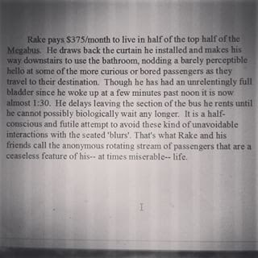

# make-alex-famous-book
A collaborative novel-writing project, featuring Alex's already-famous, kid-living-on-a-bus premise.

  

Above is a real, unedited photograph of a computer screen displaying the cannon. Credit: Alex

## wot
Write a novel together using that goldmine young adult novel premise dreamed up by first-place modeloing cross country runner && elite programmer, Alex, while on a bus trip. 

## why
 - Synergy
 - Friendship
 - Love
 - Honor
 - Making Alex famous novel-premise-inventor
 - More green contribution dots on github
 - The passive income we'll be making when our open-source novel is adapted to blockbuster film

## how
I don't know exactly. PRs. Agile method. Free-flowing, unbridled, raw imaginitivity. Know that make-alex-famous-book repo is the blank canvas I place in your outstretched hands. Our eyes meet and we nod knowingly, maintaining our solemn gaze until you turn and gallop off into the velvety night, ready for the adventure to begin . . .
